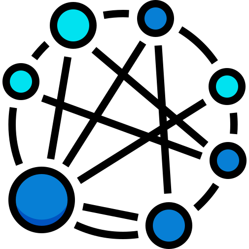

<section class="hero">
  

    
    

      <h1>Yorkie</h1>
      <h2>Document store for building collaborative editing applications</h2>
    

  

  

</section>
<section class="content">
  

    <h2>
    Yorkie does
    </h2>
    <ul class="card-list">
      <li class="card">
        

          

            <h3>Just Out-of-Box</h3>
            <h4>SDKs, Agent and Database</h4>
          

          

            
          

        

        

          

          Yorkie provides <a href="/docs/js-sdk">SDKs</a>, <a href="/docs/agent">Server</a>, and <a href="/docs/agent#running-agent-with-mongodb">Database</a> to eliminate the tedious work can be operational and can use the services just out-of-box. Yorkie will take care of the collaborative features while you focus on your direct services.
          

        

      </li>
      <li class="card">
        

          

            <h3>Document Store</h3>
            <h4>Builtin JSON-like document</h4>
          

          

            
          

        

        

          

          Some CRDT libraries only provide basic datatypes. It's very difficult to represent complex models of applications with the basic datatypes. Yorkie provides a general purpose <a href="/docs/js-sdk#document">JSON-like documents</a> to unleash the limitation.
          

        

      </li>
      <li class="card">
        

          

            <h3>Proofed reliability</h3>
            <h4>CRDT vs OT</h4>
          

          

            
          

        

        

          

          <a href="https://en.wikipedia.org/wiki/Conflict-free_replicated_data_type">CRDT</a> is formed solid and clean architecture, much better than <a href="https://en.wikipedia.org/wiki/Operational_transformation">OT</a>. It has been known that some OT algorithms are more complex than CRDT and cannot satisfy the convergence after publication. which would be difficult to use. Yorkie uses the well-proven <a href="/docs/internals">CRDT algorithm</a> to achieve reliable services.
          

        

      </li>
      <li class="card">
        

          

            <h3>Size matters</h3>
            <h4>Lamport timestamp and Garbage Collection</h4>
          

          

            
          

        

        

          

          <a href="https://en.wikipedia.org/wiki/Vector_clock">Vector clock</a> needs clocks per every client and it leads to large space for documents. Yorkie uses <a href="https://en.wikipedia.org/wiki/Lamport_timestamps">Lamport timestamp</a> to keep smaller document sizes and provides <a href="/docs/garbage-collection">Garbage Collection</a> that removes <a href="https://crdt.tech/glossary">tombstones</a> to keep documents from growing.
          

        

      </li>
      <li class="card">
        

          

            <h3>Auth Webhook</h3>
            <h4>Apply custom authentication</h4>
          

          

            
          

        

        

          

          Yorkie provides <a href="/docs/auth-webhook">authentication webhook</a> to use custom authentication system. The authentication system used by the application can be applied naturally.
          

        

      </li>
      <li class="card">
        

          

            <h3>Manageable warehouse</h3>
            <h4>Support Admin API</h4>
          

          

            
          

        

        

          

            Yorkie provides Admin API to browse stored documents and supervise data warehouse easily.
          

        

      </li>
    </ul>
  

</section>
<section class="contact">
  

    <h2>Need help?</h2>
    
If you have any questions along the way, please don’t hesitate to ask us in our <a href="https://dev-yorkie.slack.com/">Slack channel</a>. You can sign up for our <a href="{{site.inviter}}">Slack here</a>.

  

</section>
